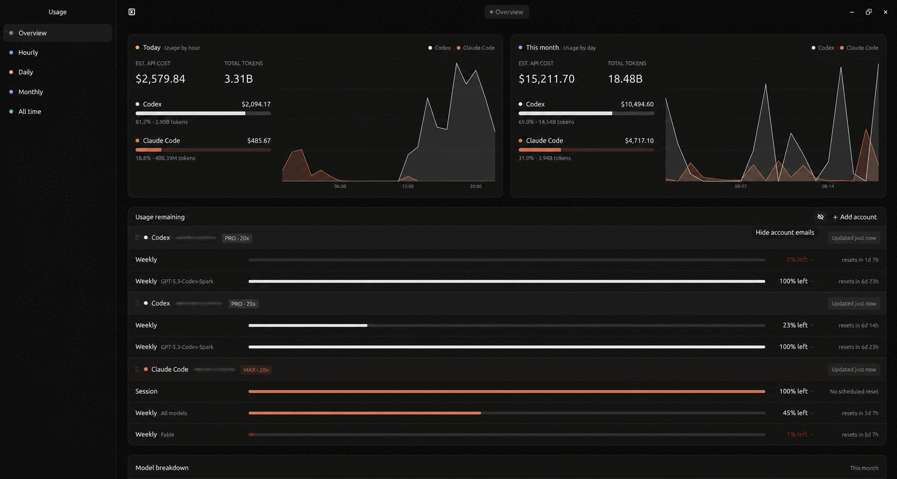

<div align="center">
  

# Tokscope

**Claude Code and Codex usage, clearly.**

Linux · Native Rust · Local-first
</div>

A local-first Linux desktop app for tracking Claude Code and Codex token usage,
estimated costs, models, and usage remaining.



## Install

### With an AI coding agent

```text
Install Tokscope from https://github.com/Luzivog/tokscope and follow its README.
```

### Manually

Tokscope currently supports Linux. Install Rust with
[rustup](https://rustup.rs/), sign in to the Codex CLI and/or Claude Code, then:

```bash
git clone https://github.com/Luzivog/tokscope.git
cd tokscope
cargo build -p tokscope --release --locked
./install.sh
```

Open **Tokscope** from your application launcher. The installer is user-local:
the binary goes to `~/.local/bin` and no `sudo` is required.

<details>
<summary>Debian / Ubuntu build requirements</summary>

```bash
sudo apt-get update
sudo apt-get install -y \
  build-essential clang cmake perl pkg-config \
  libfontconfig1-dev libvulkan-dev libwayland-dev libxcb1-dev \
  libxkbcommon-dev libxkbcommon-x11-dev
```

A working Vulkan driver and an X11 or Wayland desktop session are also
required.

</details>

## How it works

Tokscope reads local Codex and Claude Code history. Once captured, usage survives
provider-log cleanup in a compact local archive. It only goes online to refresh
plan limits and public pricing. Tokscale is not required.

Costs are API-rate estimates, not subscription spend.

## Development

```bash
cargo run -p tokscope --locked
cargo test -p tokscope --lib --locked
scripts/quality/check-repository.sh
```

Architecture, conventions, and contribution expectations are documented in
[AGENTS.md](AGENTS.md).

## Credits and license

Tokscope is available under the [MIT License](LICENSE). The ingestion engine was
derived from Tokscale; attribution is preserved in [NOTICE](NOTICE). The UI was
inspired by [T3 Code](https://github.com/pingdotgg/t3code).
