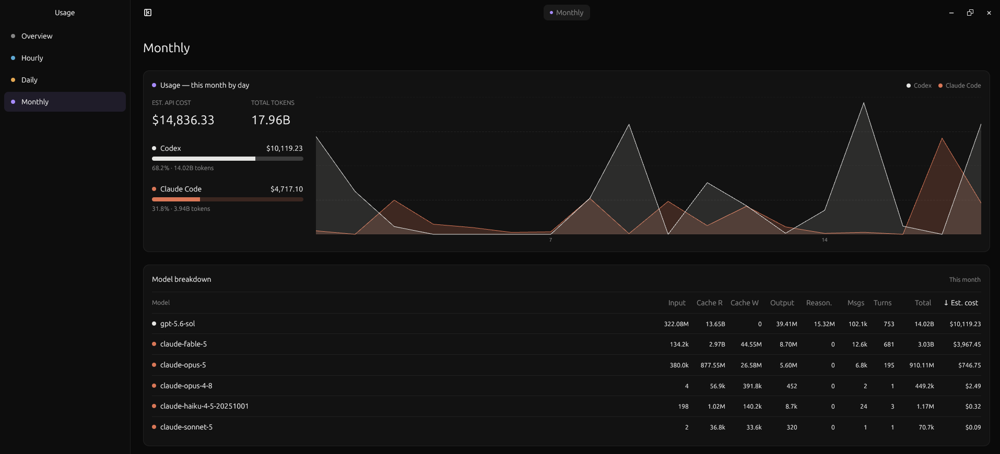

<div align="center">
  

# Tokscope

**Understand your AI coding usage at a glance.**

Linux · Native Rust · Local-first
</div>

Tokscope brings Codex and Claude Code usage into one quiet desktop app. See
token history, estimated API cost, model activity, and plan limits without
sending your local session history to another service.


## See everything at a glance

- **All your accounts together.** Add multiple Codex or Claude Code accounts
  and reorder them however you like.
- **The right level of detail.** Move between hourly, daily, and monthly usage
  without losing the overall picture.
- **Understand every token.** Compare models, input, output, cache usage,
  reasoning tokens, messages, turns, and estimated API cost.
- **Know what is left.** See current plan-limit windows, with the latest good
  snapshot kept visible if a provider is temporarily unavailable.



## Install

Tokscope currently supports Linux. Install Rust with
[rustup](https://rustup.rs/), sign in to the Codex CLI and/or Claude Code, then:

```bash
git clone https://github.com/Luzivog/tokscope.git
cd tokscope
cargo build -p tokscope --release --locked
./install.sh
```

Open **Tokscope** from your application launcher. The installer is user-local:
the binary goes to `~/.local/bin` and no `sudo` is required.

<details>
<summary>Debian / Ubuntu build requirements</summary>

```bash
sudo apt-get update
sudo apt-get install -y \
  build-essential clang cmake perl pkg-config \
  libfontconfig1-dev libvulkan-dev libwayland-dev libxcb1-dev \
  libxkbcommon-dev libxkbcommon-x11-dev
```

A working Vulkan driver and an X11 or Wayland desktop session are also
required.

</details>

## How it works

Tokscope scans the local history created by the provider CLIs, then performs
parsing, deduplication, pricing, and aggregation inside this repository. One
incremental scan powers every view, while provider limits and pricing can be
refreshed over the network. Successful aggregates and plan snapshots are
cached locally so the last known data remains useful when a refresh fails.

Local snapshots and managed account profiles live under
`${XDG_DATA_HOME:-~/.local/share}/tokscope/`. Additional accounts authenticate
through the provider's official CLI in an isolated home; Tokscope does not copy
OAuth grants or replace the CLI account you already use.

The ingestion engine in `crates/tokscope-ingest/` was originally derived from
Tokscale under the MIT License and is now maintained as part of Tokscope.
Building or running Tokscope does **not** download, install, or launch Tokscale.

Estimated API cost shows what the tokens would cost at published API rates; it
is not subscription spend.

## Development

```bash
cargo run -p tokscope --locked
cargo test --workspace --all-targets --locked
cargo fmt --all --check
cargo clippy --workspace --all-targets --locked -- -D warnings
scripts/quality/check-repository.sh
```

Architecture, conventions, and contribution expectations are documented in
[AGENTS.md](AGENTS.md).

## Credits and license

Tokscope is available under the [MIT License](LICENSE). Tokscale attribution
and the license for derived ingestion code are preserved in [NOTICE](NOTICE)
and [`crates/tokscope-ingest/LICENSE`](crates/tokscope-ingest/LICENSE).
